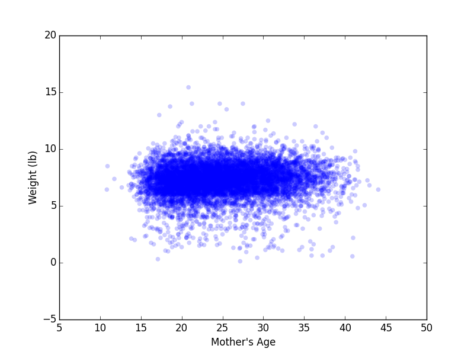

[Think Stats Chapter 7 Exercise 1](http://greenteapress.com/thinkstats2/html/thinkstats2008.html#toc70) (weight vs. age)

>> I make a scatterplot based on the NSFG data to show pregnancy age vs birth weight using the following Python script:  

```python
import thinkstats2
import thinkplot
import first
import math
import pandas
import numpy

## Use package first.py from the book to load the NSFG stats
live, first, others = first.MakeFrames()
## Isolate columns for pregnancy age and birth weight
data = live[['agepreg', 'totalwgt_lb']]
## Take out NA data
data = data.dropna()

## Plot scatterplot
thinkplot.Scatter(data['agepreg'], data['totalwgt_lb'])
thinkplot.Show(xlabel = "Mother's Age", ylabel = 'Weight (lb)')

## Calculate Pearson's correlation by transforming data into arrays first
x = numpy.asarray(data['agepreg'])
y = numpy.asarray(data['totalwgt_lb'])
covariance = numpy.dot(x-x.mean(), y-y.mean()) / len(x)
correlation = covariance / math.sqrt(x.var() * y.var())
print "Pearson's correlation: %r" %correlation

## Calculate Spearman's rank correlation by transforming to pandas Series
x_series = pandas.Series(x)
y_series = pandas.Series(y)
spearman = x_series.corr(y_series, method='spearman')
print "Spearman's correlation: %r" %spearman
```

>> The following scatterplot:  
>>   
>> And the calculated correlations shows that there is pretty much no correlation between the 2 data set.  
>> `Pearson's correlation: 0.068833970354109097`  
>> `Spearman's correlation: 0.094610041096582262`
