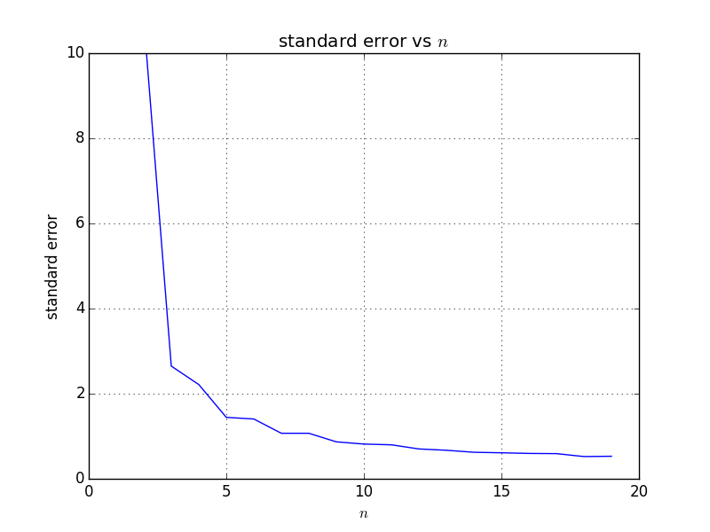

[Think Stats Chapter 8 Exercise 2](http://greenteapress.com/thinkstats2/html/thinkstats2009.html#toc77) (scoring)

>> In this exercise, I draw a sample from an exponential distribution and estimate its sample mean
>> then compare it with the actual mean to find the standard error.

>> Python code below

```python
import math
import numpy as np
import scipy.stats
import matplotlib.pyplot as plt

## Function to calculate RMSE. Borrowed from Think Stats book
def RMSE(estimates, actual):
    e2 = [(estimate-actual)**2 for estimate in estimates]
    mse = np.mean(e2)
    return math.sqrt(mse)

## Function to estiamte an sample of size n in an exponential distribution
def estimate(lam = 2, n = 10, m = 1000):
    estimates = []
    ## Run it m times. Default 1,1000
    for j in range(m):
        x = np.random.exponential(1.0/lam, n)
        lamhat = 1.0 / x.mean()
        estimates.append(lamhat)

    ## Calls RMSE function to calculate standard error
    standard_error = RMSE(estimates, 2)
    ## Calculates the 90% confidence interval
    conf_interval = scipy.stats.norm.interval(0.90, loc=np.mean(estimates), scale=np.std(estimates)/math.sqrt(n))

    #print 'Standard Error (RMSE): %r' %standard_error
    #print '90%% Confidence Interval: (%r, %r)' %(conf_interval[0], conf_interval[1])
    return standard_error

def main():
    ## Runs the simulation for n 1 to 30 and store their standard error in list
    error = [estimate(lam = 2, n=n, m = 1000) for n in range(1,20)]

    ## Make it into a numpy list
    x = np.array(range(1,20))
    y = np.array(error)

    ## Plots n with their error
    plt.plot(x, y)
    plt.title(r'standard error vs $n$')
    plt.xlabel(r'$n$')
    plt.ylabel('standard error')
    plt.axis([0, 20, 0, 10])
    plt.grid(True)
    plt.show()


if __name__ == "__main__":
    main()
```

>> I iterate n from values of 1 to 20 and find that the error decreases as n increases.
>> In each case, the actual mean (2) lies within the 90% confidence interval.

>> Here's a graph showing the standard error vs sample size n
>> 
