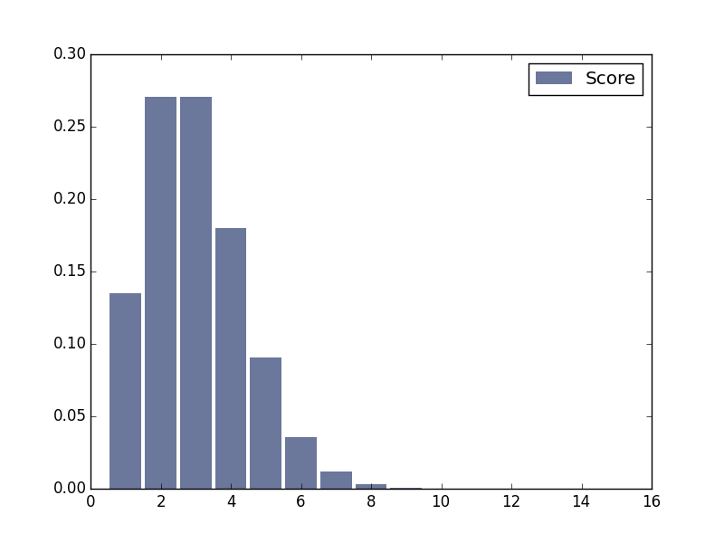

[Think Stats Chapter 8 Exercise 3](http://greenteapress.com/thinkstats2/html/thinkstats2009.html#toc77)

---

>> In this exercise, I simulate a soccer game that follows an exponential distribution.  
>> Using the Python code below, I see that simulation of many games with lambda = 2 looks likes:  
>>   

>> Mean error is pretty small and decreases with m, so this estimate is not biased.

>> As lambda increases, the standard error increases.

```python
import numpy as np
import math
import thinkstats2
import thinkplot
import scipy.stats

## This function takes the goal-scoring rate lambda and simulates a game by generating
## the time between goals until the game is over
def simulate(lam):
    time = 0.
    score = 0
    while time < 1:
        t = np.random.exponential(1./lam)
        time += t
        score += 1
        #print time, score
    return score

## defined RMSE function from previous exercise
def RMSE(estimates, actual):
    e2 = [(estimate-actual)**2 for estimate in estimates]
    mse = np.mean(e2)
    return math.sqrt(mse)

## This function simulates n games, with defaults to 1000. Prints the mean error
## and RMSE, and return the standard error
def simulate_many_games(n = 1000000, lam = 2):
    estimate = [simulate(lam) for x in range(n)]
    actual_mean = lam

    ## Calculate the mean error and RMSE
    errors = [x-actual_mean for x in estimate]
    mean_error = np.mean(errors)

    rmse = RMSE(estimate, actual_mean)
    print "Mean error: %r" %mean_error
    print "RMSE: %r" %rmse

    ## Plot sampling distribution
    pmf = thinkstats2.Pmf(estimate)
    thinkplot.Hist(pmf, label = 'Score')
    thinkplot.Show()

    ## 90% CI
    conf_interval = scipy.stats.norm.interval(0.90, loc=np.mean(estimate), scale=np.std(estimate)/math.sqrt(n))
    #print conf_interval

    return rmse

def main():
    simulate_many_games()

    #y = [simulate_many_games(10000, lam) for lam in range(2,10)]


if __name__ == "__main__":
    main()

```

---
